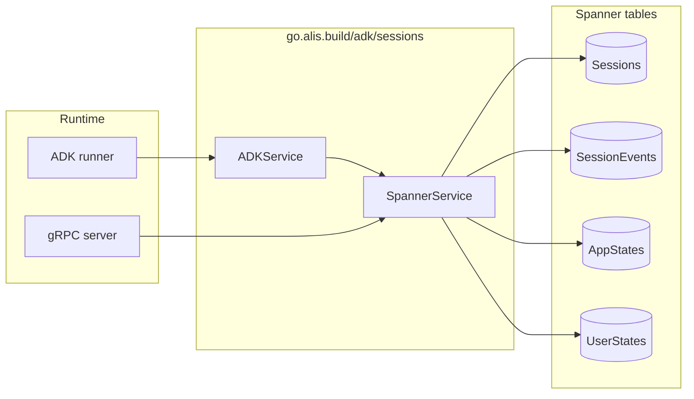

# ADK SESSIONS GO

[](LICENSE)



This project contains a Go package for persisting ADK sessions in Google Cloud Spanner.

The package exposes one storage implementation and one adapter on top of it:

- `SpannerService` provides CRUD and event append operations over `go.alis.build/common/alis/adk/sessions/v1`.
- `ADKService` implements `google.golang.org/adk/session.Service` on top of the same Spanner-backed store.

The core idea is simple: keep the session record, the event stream, app-scoped state, and user-scoped state in a single persistence model so your ADK runner and your gRPC API stay aligned.

## Features

- **Spanner-backed session persistence:** Stores sessions and events in protobuf-backed Spanner tables.
- **ADK integration:** [`NewADKService`](adk_service.go) adapts the same store to `google.golang.org/adk/session.Service`.
- **Generated gRPC API support:** [`(*SpannerService).Register`](spanner.go) registers the protobuf `SessionService` server on your gRPC server.
- **Scoped state handling:** App state, user state, and session state are stored separately and recomposed for ADK consumers.
- **Minimal runtime surface:** The public API is intentionally small: configure the store once, then use it from both the ADK runner and gRPC transport.

## Package surface

| API | Role |
| --- | --- |
| [`NewSpannerService`](spanner.go) | Creates the backing Spanner store from [`SpannerConfig`](spanner.go). |
| [`(*SpannerService).Register`](spanner.go) | Registers the generated `SessionService` gRPC server. |
| [`NewADKService`](adk_service.go) | Wraps the store as `google.golang.org/adk/session.Service`. |
| [`DatabaseSession`](adk_service.go) | ADK-facing session implementation that exposes merged state and ordered events. |

The expected schema is documented in [`doc.go`](doc.go).

## Architecture



At read time, the package reconstructs the ADK view from four storage concerns:

- **Session record:** Per-conversation metadata and session-scoped state.
- **Event stream:** Ordered session history.
- **App state:** Shared state for an app across users and sessions.
- **User state:** Shared state for a user within an app across sessions.

That split is the key design concept of this package. ADK callers see one merged session view, while Spanner keeps each scope explicit.

## Installation

```bash
go get -u go.alis.build/adk/sessions
```

## Intentional setup flow

Treat the package as three deliberate steps:

1. **Provision the backing Spanner schema** your runtime will depend on.
2. **Instantiate `SpannerService`** with table names that exactly match that schema.
3. **Reuse the same store** for both ADK session handling and the generated gRPC API.

The important constraint is that the runtime configuration is not separate from the infrastructure contract. If your Terraform names and your `SpannerConfig` values drift apart, the package will not find the session, event, or state tables it expects.

## Getting started

### Step 1: Provision the backing tables first

The package expects four Spanner tables:

- `Sessions`
- `SessionEvents`
- `AppStates`
- `UserStates`

Following the same pattern we use elsewhere, keep the infrastructure contract visible in a dedicated module instead of scattering the table definitions through the root `infra` folder:

```text
infra/
  main.tf
  variables.tf
  modules/
    alis.adk.sessions.v1/
      main.tf
```

The root module wires the sessions package like this:

```hcl
module "alis_adk_sessions_v1" {
  source = "./modules/alis.adk.sessions.v1"

  alis_os_project               = var.ALIS_OS_PROJECT
  alis_managed_spanner_project  = var.ALIS_MANAGED_SPANNER_PROJECT
  alis_managed_spanner_instance = var.ALIS_MANAGED_SPANNER_INSTANCE
  alis_managed_spanner_db       = var.ALIS_MANAGED_SPANNER_DB
  neuron                        = local.neuron
}
```

Inside `infra/modules/alis.adk.sessions.v1/main.tf`, define the tables expected by the package. A minimal module looks like this:

```hcl
resource "alis_google_spanner_table" "sessions" {
  project         = var.alis_managed_spanner_project
  instance        = var.alis_managed_spanner_instance
  database        = var.alis_managed_spanner_db
  name            = "${replace(var.alis_os_project, "-", "_")}_${replace(var.neuron, "-", "_")}_Sessions"
  prevent_destroy = false

  schema = {
    columns = [
      {
        name           = "session_id"
        type           = "STRING"
        is_primary_key = true
        required       = true
      },
      {
        name           = "app_name"
        type           = "STRING"
        is_primary_key = true
        required       = true
      },
      {
        name           = "user_id"
        type           = "STRING"
        is_primary_key = true
        required       = true
      },
      {
        name          = "Session"
        type          = "PROTO"
        proto_package = "alis.adk.sessions.v1.Session"
        required      = true
      },
      {
        name          = "Policy"
        type          = "PROTO"
        proto_package = "google.iam.v1.Policy"
        required      = false
      },
      {
        name            = "create_time"
        type            = "TIMESTAMP"
        required        = false
        is_computed     = true
        computation_ddl = "TIMESTAMP_ADD(TIMESTAMP_SECONDS(Session.create_time.seconds), INTERVAL CAST(FLOOR(Session.create_time.nanos / 1000) AS INT64) MICROSECOND)"
        is_stored       = true
      },
      {
        name            = "update_time"
        type            = "TIMESTAMP"
        required        = false
        is_computed     = true
        computation_ddl = "TIMESTAMP_ADD(TIMESTAMP_SECONDS(Session.update_time.seconds), INTERVAL CAST(FLOOR(Session.update_time.nanos / 1000) AS INT64) MICROSECOND)"
        is_stored       = true
      },
    ]
  }
}

resource "alis_google_spanner_table" "session_events" {
  project         = var.alis_managed_spanner_project
  instance        = var.alis_managed_spanner_instance
  database        = var.alis_managed_spanner_db
  name            = "${replace(var.alis_os_project, "-", "_")}_${replace(var.neuron, "-", "_")}_SessionEvents"
  prevent_destroy = false

  schema = {
    columns = [
      {
        name           = "session_id"
        type           = "STRING"
        is_primary_key = true
        required       = true
      },
      {
        name           = "app_name"
        type           = "STRING"
        is_primary_key = true
        required       = true
      },
      {
        name           = "user_id"
        type           = "STRING"
        is_primary_key = true
        required       = true
      },
      {
        name           = "event_id"
        type           = "STRING"
        is_primary_key = true
        required       = true
      },
      {
        name          = "SessionEvent"
        type          = "PROTO"
        proto_package = "alis.adk.sessions.v1.SessionEvent"
        required      = true
      },
      {
        name          = "Policy"
        type          = "PROTO"
        proto_package = "google.iam.v1.Policy"
        required      = false
      },
      {
        name            = "timestamp"
        type            = "TIMESTAMP"
        required        = false
        is_computed     = true
        computation_ddl = "TIMESTAMP_ADD(TIMESTAMP_SECONDS(SessionEvent.timestamp.seconds), INTERVAL CAST(FLOOR(SessionEvent.timestamp.nanos / 1000) AS INT64) MICROSECOND)"
        is_stored       = true
      },
    ]
  }
}

resource "alis_google_spanner_table" "app_states" {
  project         = var.alis_managed_spanner_project
  instance        = var.alis_managed_spanner_instance
  database        = var.alis_managed_spanner_db
  name            = "${replace(var.alis_os_project, "-", "_")}_${replace(var.neuron, "-", "_")}_AppStates"
  prevent_destroy = false

  schema = {
    columns = [
      {
        name           = "app_name"
        type           = "STRING"
        is_primary_key = true
        required       = true
      },
      {
        name          = "AppState"
        type          = "PROTO"
        proto_package = "alis.adk.sessions.v1.AppState"
        required      = true
      },
      {
        name          = "Policy"
        type          = "PROTO"
        proto_package = "google.iam.v1.Policy"
        required      = false
      },
      {
        name            = "update_time"
        type            = "TIMESTAMP"
        required        = false
        is_computed     = true
        computation_ddl = "TIMESTAMP_ADD(TIMESTAMP_SECONDS(AppState.update_time.seconds), INTERVAL CAST(FLOOR(AppState.update_time.nanos / 1000) AS INT64) MICROSECOND)"
        is_stored       = true
      },
    ]
  }
}

resource "alis_google_spanner_table" "user_states" {
  project         = var.alis_managed_spanner_project
  instance        = var.alis_managed_spanner_instance
  database        = var.alis_managed_spanner_db
  name            = "${replace(var.alis_os_project, "-", "_")}_${replace(var.neuron, "-", "_")}_UserStates"
  prevent_destroy = false

  schema = {
    columns = [
      {
        name           = "app_name"
        type           = "STRING"
        is_primary_key = true
        required       = true
      },
      {
        name           = "user_id"
        type           = "STRING"
        is_primary_key = true
        required       = true
      },
      {
        name          = "UserState"
        type          = "PROTO"
        proto_package = "alis.adk.sessions.v1.UserState"
        required      = true
      },
      {
        name          = "Policy"
        type          = "PROTO"
        proto_package = "google.iam.v1.Policy"
        required      = false
      },
      {
        name            = "update_time"
        type            = "TIMESTAMP"
        required        = false
        is_computed     = true
        computation_ddl = "TIMESTAMP_ADD(TIMESTAMP_SECONDS(UserState.update_time.seconds), INTERVAL CAST(FLOOR(UserState.update_time.nanos / 1000) AS INT64) MICROSECOND)"
        is_stored       = true
      },
    ]
  }
}
```

At the end of this step, you should know these concrete values:

| Value | Why it matters |
| --- | --- |
| `Project`, `Instance`, `Database` | Tells the package which Spanner database to connect to. |
| `SessionsTable`, `EventsTable`, `AppStatesTable`, `UserStatesTable` | Must match the actual table names you provisioned. |
| `DatabaseRole` | Optional Spanner database role used by the client. |

### Step 2: Create the store with matching values

Once the tables exist, construct the backing store with the exact same names:

```go
package main

import (
	"context"
	"log"

	sessions "go.alis.build/adk/sessions"
)

func initSessionStore(ctx context.Context) *sessions.SpannerService {
	store, err := sessions.NewSpannerService(ctx, sessions.SpannerConfig{
		Project:         "SPANNER_PROJECT_ID",
		Instance:        "SPANNER_INSTANCE_ID",
		Database:        "SPANNER_DATABASE_ID",
		DatabaseRole:    "OPTIONAL_DATABASE_ROLE",
		SessionsTable:   "my_agent_v2_Sessions",
		EventsTable:     "my_agent_v2_SessionEvents",
		AppStatesTable:  "my_agent_v2_AppStates",
		UserStatesTable: "my_agent_v2_UserStates",
	})
	if err != nil {
		log.Fatalf("init session store: %v", err)
	}
	return store
}
```

If you keep the default table names (`Sessions`, `SessionEvents`, `AppStates`, `UserStates`), you can omit the table fields from `SpannerConfig`.

### Step 3: Reuse the same store everywhere

Use the backing store directly for the generated gRPC API:

```go
import "google.golang.org/grpc"

grpcServer := grpc.NewServer()
store.Register(grpcServer)
```

Then wrap the same store for ADK:

```go
adkSessionService := sessions.NewADKService(store)
```

That gives you one persistence implementation shared across both layers instead of two diverging session systems.

## Example ADK wiring

```go
package main

import (
	"context"
	"log"

	sessions "go.alis.build/adk/sessions"
	adksession "google.golang.org/adk/session"
)

func initSessionService(ctx context.Context) adksession.Service {
	store, err := sessions.NewSpannerService(ctx, sessions.SpannerConfig{
		Project:         "my-spanner-project",
		Instance:        "my-spanner-instance",
		Database:        "my-spanner-database",
		SessionsTable:   "Sessions",
		EventsTable:     "SessionEvents",
		AppStatesTable:  "AppStates",
		UserStatesTable: "UserStates",
	})
	if err != nil {
		log.Fatalf("init session store: %v", err)
	}

	return sessions.NewADKService(store)
}
```

## State model

One detail matters when you use this package with ADK state:

- Session-scoped keys stay on the `Session` record.
- App-scoped keys are written to `AppStates`.
- User-scoped keys are written to `UserStates`.
- Temporary ADK keys are ignored for persistence.

On reads, `DatabaseSession` merges those scopes back into the ADK-facing state view. On event append, state deltas are applied back to the in-memory session view so the runner sees the latest state immediately.

## Notes

- The package is designed around Spanner `PROTO` columns rather than ad hoc JSON blobs.
- Optional `Policy` columns are supported by the documented schema and match the internal layout we use.
- The authoritative schema description remains in [`doc.go`](doc.go).
